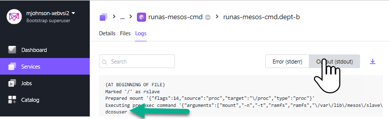

# DC/OS Marathon RunAS "user" 

By Default DC/OS Marathon Apps run each container under the default user, which while configurable has a tendency to run as ```root```. However, The DC/OS Marathon RunAS "user" enables the execution of a Marathon APP as a specific "Linux" user when running as a **"MESOS"** or a **UCR** (Universal Container Runtime) container.  

While **Docker** Runtimes are not supported for the Marathon RunAS "user" functionality, the UCR container is fully backward supported with Docker, thus you should have little concern with compatibility.

The examples described here cover the following use cases:
* Marathon App running a bash shell command
* Marathon App running a Docker Image on the UCR


## Requirements
* DC/OS Version 1.10+ cluster installed and healthy.
* Universe Container Runtime (UCR) Containerizer strategy.
* The targeted Linux runAS "user" must already exist on all the DC/OS cluster agent nodes where this app is likely to deploy (so save yourself some time and make certain the user exists on ALL of your agent nodes).  For the examples describe here, make certain that the Linux host user **'dcosuser'** (group=dcos) is defined to all agents.
* For the examples described here make certain your host has the following two directories; "/data/org_super_secret" with only root access and "/data/my_data" with 'dcosuser' rw access. (see bash script 'define_host_directories.sh')

## Example #1: Marathon App running a bash shell command
For this example we we will utilize the file ```runas-mesos-cmd.json``` from within this registry.
 
 The full Marathon JSON example is shown below:
 ```json
{
  "id": "/dept-b/runas-mesos-cmd",
  "instances": 1,
  "portDefinitions": [],
  "container": {
    "type": "MESOS",
    "volumes": []
  },
  "cmd": "whoami && tee file && sleep 1000",
  "user": "dcosuser"
}
```
In the example above, we see that the container type specified is MESOS, and that no image is specified (that will be happen in the next example).  The key to the runAs "user" functionality is the "user" JSON element where we ask Marathon to run the 'whoami' command as the 'dcosuser'.  As mentioned before, the 'dcosuser' user must exist on the host machine where this Marathon App will run.  If the 'dcosuser' is not present there will be an error.

Now that we have the example defined, it is time to run it.  We can submit this Marathon App via the DC/OS GUI or the DC/OS CLI.  For this now, let's use the DC/OS CLI in the form shown below:
```
dcos marathon app add runas-mesos-cmd.json
```

We will then go to the Apache MESOS screen to check on the stdout for our new application.



As we see in the screen clip above, the output from the 'whoami' command is as expected 'dcosuser'.

## Example #2: Marathon App running a Docker image within UCR
Building on Example #1, we now want to do the same sort of RunAS functionality only this time we wish to do this leveraging an existing Docker Image file, but still running with the MESO container (UCR) type.  In this case as with any other MESOS UCR App, we will specify the docker image file as shown using the python docker image file as presented below:


```json
{
  "id": "/dept-b/ex2-runas-mesos-cmd",
  "cmd": "whoami && python hello-world.py",
  "container": {
    "type": "MESOS",
    "volumes": [],
    "docker": {
      "image": "markfjohnson/python",
      "forcePullImage": false,
      "parameters": []
    }
  },
  "cpus": 1,
  "disk": 0,
  "fetch": [
    {
      "uri": "https://raw.githubusercontent.com/markfjohnson/dcos-runas/199438ffaf9db6640317b08e64a1acacf6345410/hello-world.py",
      "extract": false,
      "executable": false,
      "cache": false
    }
  ],
  "instances": 1,
  "mem": 128,
  "user": "dcosuser"
}
```
As we see above the "user" command is defined in the exact same way as for example #1.  An **important difference** between the prior example and this one is here the Linux user 'docuser' is defined within the docker image itself.  In the Docker image markfjohnson/python the user 'dcosuser' was defined as part of the docker image build process.  The benefit of the MESOS UCR container as we see here is we can inject files such as the python hello-world.py file and also control the logged in user right into the container.  This functionality is not possible with the Docker daemon in DC/OS.  Running under a specific user for a Docker container would require the USER directive at build time.

## Example #3: Using the RunAS functionality to restrict host volume access.
Ok, if you are still reading this maybe you find the functionality kinda cool.  But you are also probably also wondering **SO WHAT**?  To answer this question, consider a situation where you need to restrict the container to a specific set of Linux resources.  In a traditional Machine based (non-container) execution environment problem would simply be solved through the leverage of traditional Linux permissioning to the file system and other resources.  We want the ability to flexibly specify a user to execute the process and we do not want to define the Dockerfile with that user.